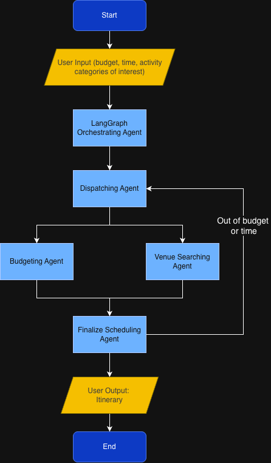

# Hack-Brown

# Our inspiration

In the age of chat bots, AI, despite the technological opportunities it presents, has garnered a reputation as a weapon of division and as a roadblock to truly personal interaction with other humans. However, after listening to the presentations given by the Visa team, our team determined that this was not a hard rule; in fact, just the opposite. After learning about the upcoming Visa Intelligent Commerce api, we saw the potential that AI agents have to turn daily planning from a complex task into the path of least resistance. In doing so, we aim to show that AI can be used to foster a stronger and more connected community than ever before. This invaluable ability to leverage Agentic AI to help users engage with the community is how we plan to meet Visa's rigorous standards of trust and security.

# What it does

Our web app mobilizes AI agents to scour the internet for events and venues that match a user's profile defined by their interests. These agents coordinate to build a schedule to fill a user's free time. From here, the user must consent to the corresponding payments. This service transforms a long, tedious effort into something quick, easy, and efficient. Our project is a demo of our vision for how users would interact with Visa's Intelligent Commerce API; in order to keep users away from cash, the API reduces the entire process of planning a day into a simple button tap.

# How we built it

Utilizing Fetch.ai, we were able to relegate tasks such as organizing a user's hobbies, finding a large budget-friendly pool of venues, and filtering and scheduling these events based on interests/availability to multiple AI agents. Additionally, using map data from MapBox we display the relative locations of each of the different venues. 

# Challenges we ran into

1. Our biggest challenge was that we had to expand our idea as the API reflected the initial one that we'd fully built our plan around.
2. Another major challenge was that we intended for purchasing to be fully functional, but faced too many issues with implementing payment in fetch.ai's agents, so we transitioned our project to be a demo for our vision of Visa's Intelligent Commerce API since this software was always meant as showcase of it's capabilities
3. We tried using Eventbrite, OpenRestaurant, and DoorDash to book restaurants, find tickets, and other activities but we needed to partner with them to get the API key so we had to look for other options.
4. Because we legally can’t make the bot automatically enter card details, we've identified Stripe as our only legal option. 

# Accomplishments we're proud of

We are very proud of what we've accomplished at Hack at Brown! While our project is currently a demo for how Agentic AI can be used to participate in the VISA community, we take great pride in knowing that our product serves as a valuable pilot run for many features that VISA is currently exploring and developing in their VAS and PPD wings. 

# What we learned 
Our team gained a plethrora of experience in developing Agentic workflows, such as those offered by Fetch.AI's AgentVerse and ASI tools. On a more ground-level basis, our team learned through trial and error that we have to save our local copies to GitHub very frequently, and not wait until all features are fully developed before doing so. This experience made us far more systematic and methodical programmers, and made us much more aware of the importance of ensuring redundancy both within our code and the process we used to code it. 

# What's next for Team VISOR
Later down the line, we’ll be able to grow our solution by using the Intelligent Commerce API, which would allow us to implement more seamless transactions in the near future. 

 

