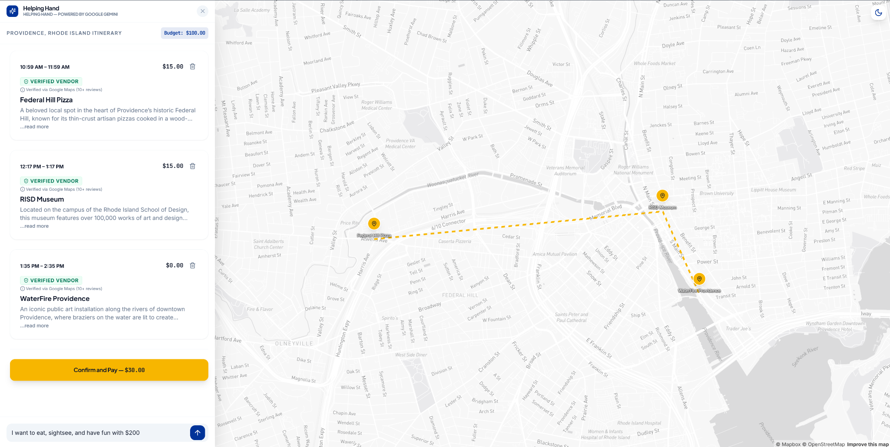

# Hack-Brown

# Our inspiration

In the age of chat bots, AI, despite the technological opportunities it presents, has garnered a reputation as a weapon of division and as a roadblock to truly personal interaction with other humans. However, after listening to the presentations given by the Visa team, our team determined that this was not a hard rule; in fact, just the opposite. After learning about the upcoming Visa Intelligent Commerce api, we saw the potential that AI agents have to turn daily planning from a complex task into the path of least resistance. In doing so, we aim to show that AI can be used to foster a stronger and more connected community than ever before.

# What it does

Our web app mobilizes AI agents to scour the internet for events and venues that match a user's profile defined by their interests. These agents coordinate to build a schedule to fill a user's free time. From here, the user must consent to the corresponding payments. This service transforms a long, tedious effort into something quick, easy, and efficient.

# How we built it

Utilizing Fetchai, we were able to relegate tasks such as organizing a user's hobbies, finding a large budget-friendly, pool of venues, and filtering and scheduling these events based on interests/availability to multiple AI agents. Additionally, using map data from MapBox we display the relative locations of each of the different venues. 

# Challenges we ran into

1. Our biggest challenge was that we had to pivot our idea since the API reflected the initial one that we'd fully built our plan around.
2. Another major challenge was that we intended for purchasing to be fully functional, but with fetch.ai's instabilities, we could not get it functioning, so we cut the purchasing feature since it was always meant for Visa's API 

# accomplishments we're proud of

#whats next for ___insert name here____?

While we are proud of what we were able to accomplish, we were held back by the fact that we did not have access to the APi.

# Roadmap
 later down the line, we’ll be able to grow our solution by using the Intelligent Commerce API, which would allow us to properly perform the transactions.

